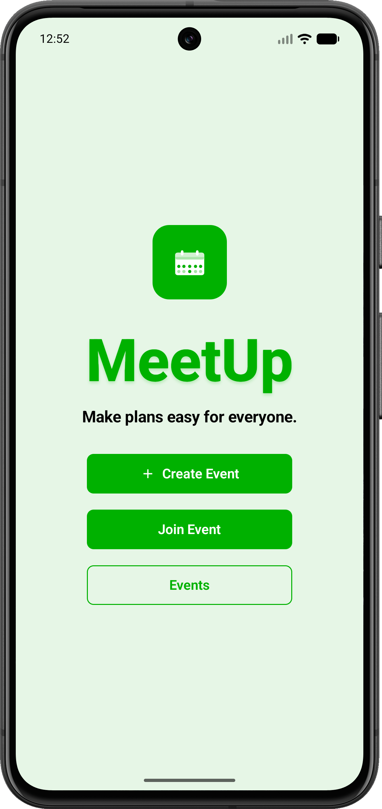
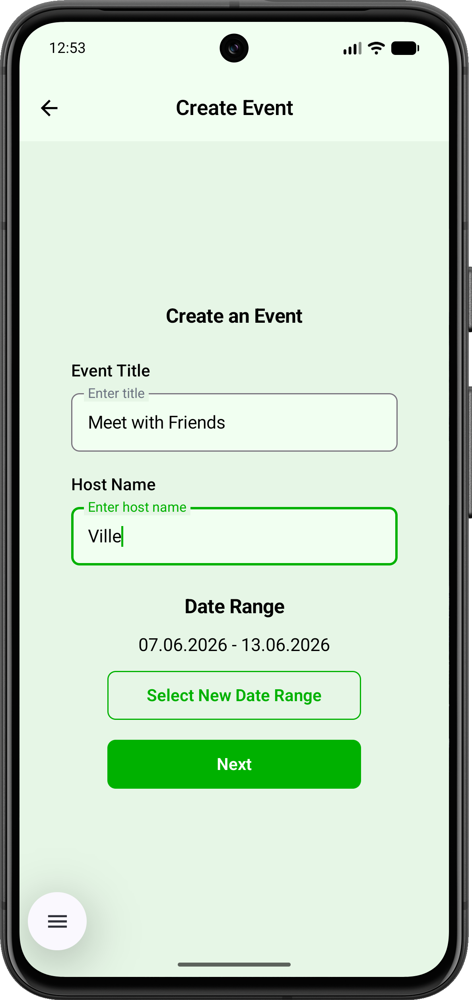
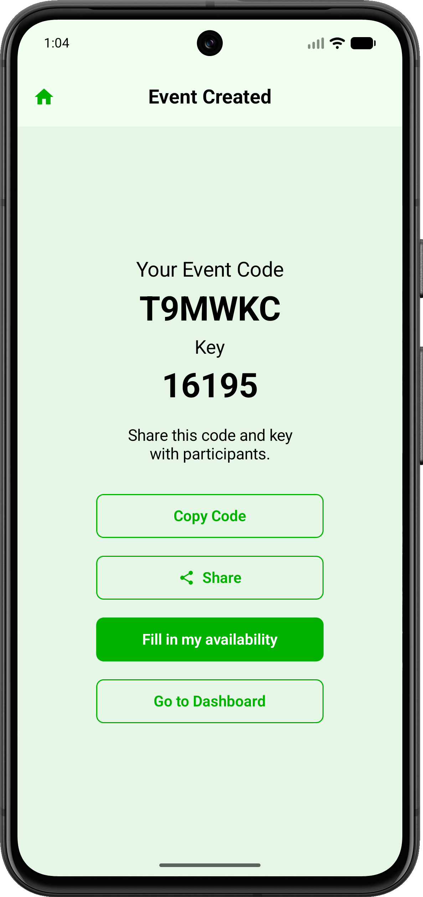
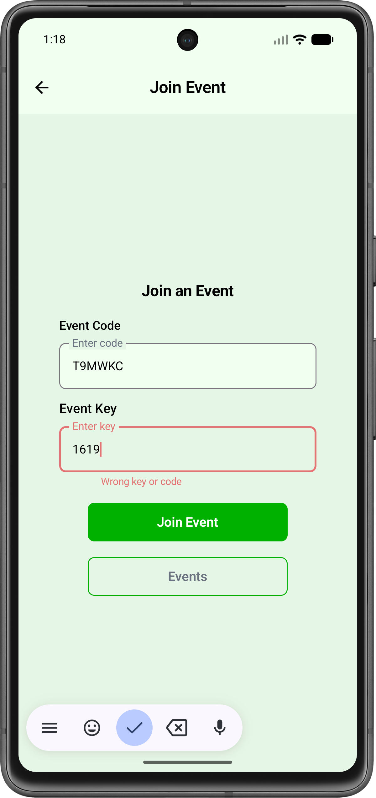
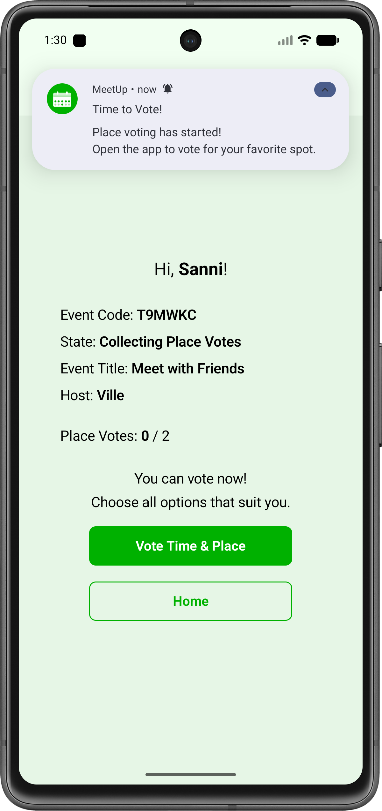
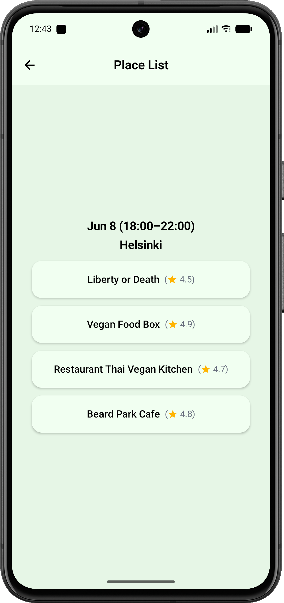
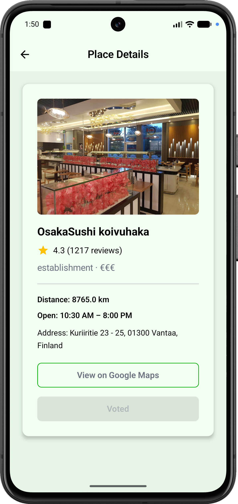
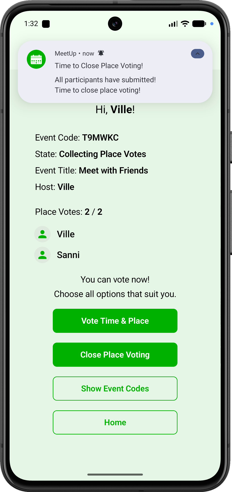
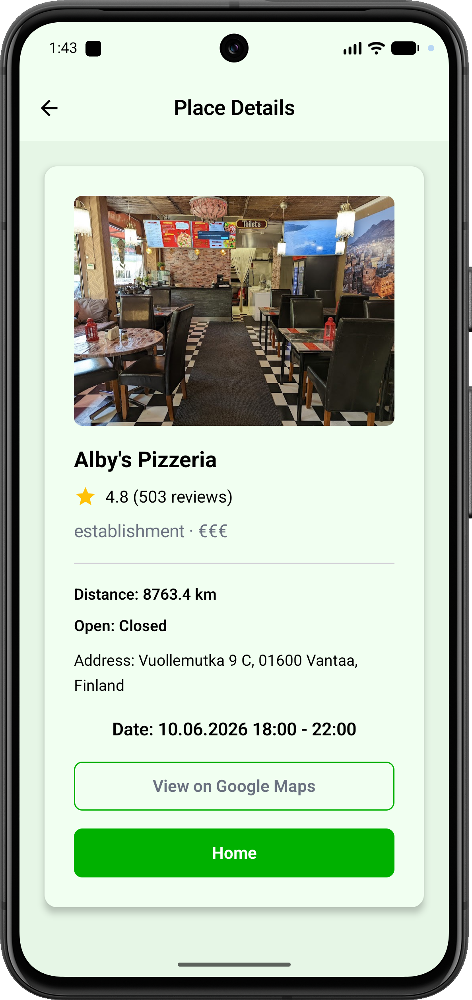
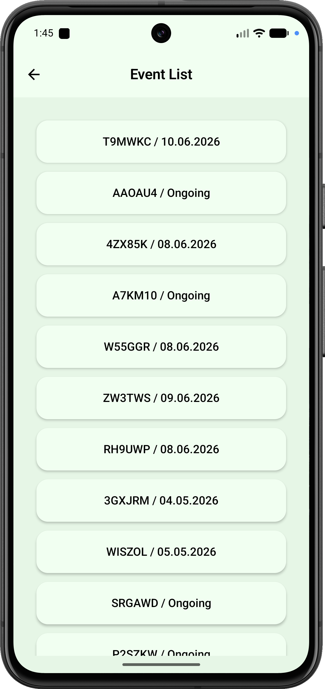

# Meeting App - MeetUp

Meeting App is a collaborative tool designed to simplify group decision-making. Whether you're planning a casual hangout or a formal gathering, our app helps groups agree on the best time and place with ease.

## App Description

This app is designed for creating plans for events and gatherings.

Users can create event plans for a group, where participants can:
- Vote for the best time
- Vote for the best place

The goal is to make group decision-making simple and fast, so everyone can agree on when and where to meet.

---

## Low-Fidelity Wireframes

Low-fidelity wireframes and early UI prototypes were created in Figma.

See the project wireframes here:

- [Wireframes PDF](docs/Meeting_App_Figma_Prototype.pdf)

---

## App Screenshots

Here are some screenshots from the final application:

|                    Home Screen                    |                       Create Event                        |                       Event Created                        |                       Join Event                        |                           Participant Screen                            |
|:-------------------------------------------------:|:---------------------------------------------------------:|:----------------------------------------------------------:|:-------------------------------------------------------:|:-----------------------------------------------------------------------:|
|  |  |  |  |  |


|                       Place List                        |                          Voting Screen                           |                          Host Dashboard                           |                       Finalized                        |                       Event List                        |
|:-------------------------------------------------------:|:----------------------------------------------------------------:|:-----------------------------------------------------------------:|:------------------------------------------------------:|:-------------------------------------------------------:|
|  |  |  |  |  |

---

## Demo Video
You can watch the demo video on YouTube:
[https://youtu.be/Wv6ErIDPG68](https://youtu.be/Wv6ErIDPG68)

---

## Features

- **Event Creation**: Host can create events and invite others via unique codes.
- **Management Dashboards**: Dedicated Host and Participant views to track event status, voting progress, and final results.
- **Collaborative Voting**: Participants vote for their preferred time slots and locations.
- **Google Places Integration**: Search and view details for restaurants and venues, including photos and opening hours.
- **Location Awareness**: Automatic distance calculation from your current location to venues using GPS.
- **Real-time Sync**: Powered by Firebase Firestore for seamless multi-user collaboration.
- **Notifications**: Users are notified when the host starts voting, when all participants have voted, and when the results are finalized.
- **Offline Support**: Local caching with Room database.

---

## Tech Stack
- **Design & Prototyping**: Figma
- **UI Framework**: Jetpack Compose + Material 3
- **Programming Language**: Kotlin
- **Navigation**: Jetpack Compose Navigation
- **Networking**: Retrofit & OkHttp, Gson (JSON Parsing)
- **Database**: Room (Local), Firebase Firestore (Cloud)
- **Authentication**: Firebase Anonymous Authentication
- **Image Loading**: Coil 3
- **Notifications**: Local Notifications via WorkManager
- **Static Code Analysis**: Detekt & Ktlint
- **Documentation**: Dokka
- **API Integration**: Google Places API

---

## Code Architecture

The project follows a clean, layered architecture to ensure separation of concerns and maintainability:

```text
app/src/main/java/com/meetup/meetingapp/
├── data/               # Data Layer: Repositories and Data Sources
│   ├── db/             # Local Room Database (DAOs, Entities, Mappers)
│   ├── model/          # Domain Models and Data Classes
│   ├── repositories/   # Repository Pattern Implementations
│   └── AppContainer.kt # Dependency Injection / Service Locator
├── network/            # Network Layer: Retrofit API Services (Google Places)
├── ui/                 # UI Layer: Jetpack Compose
│   ├── navigation/     # Navigation Graph and Route Definitions
│   ├── screens/        # Feature-based Composables and ViewModels
│   ├── theme/          # Material 3 Theme, Typography, and Colors
│   └── AppViewModelProvider.kt # ViewModels Factory
├── utils/              # Common Utilities (Formatting, Calculations)
├── worker/             # Background Tasks using WorkManager 
├── Constants.kt        # Global Application Constants
├── MainActivity.kt     # Main Entry Activity (Single Activity)
├── MeetingApp.kt       # Root Composable and NavHost Setup
└── MeetingApplication.kt # Application Class & Dependency Initialization
```

---

## Setup

### Prerequisites
- Android Studio 
- JDK 17
- Android emulator or device running API 26+

1. **Clone the repository**:

    ```sh
    git clone https://github.com/vickneee/MeetingApp.git
    ```

2. **Firebase Setup**:
   - Follow the detailed [Firebase Setup Guide](./FIREBASE.md) to add your `google-services.json`.
   
   **Note:** Ensure `app/google-services.json` is ignored by git to keep your project keys private.

3. **Google Places API**:
   - Go to the [Google Cloud Console](https://console.cloud.google.com/).
   - Enable the **Places API** for your project.
   - Create an API Key.
   - Copy `app/src/main/assets/secret.properties.example` to `app/src/main/assets/secret.properties`.
   - Replace `KEY_HERE` with your actual API key:
     ```properties
     PLACES_API_KEY=YOUR_ACTUAL_API_KEY_HERE
     ```
   
   **Note**: Ensure `app/src/main/assets/secret.properties` is ignored by git to keep your project keys private.

4. **Run**:
   - Open the project in Android Studio and run the app using the run configuration on an emulator or connected device.
   
   **Note:** Testing on a physical Android device is recommended.

--- 

## Testing

To run unit tests:
```bash
# Run unit tests
./gradlew test
```

To run instrumented UI tests (requires an emulator or physical device):

```bash
# Run instrumented UI tests
./gradlew connectedAndroidTest
```

To run static analysis and formatting:
```bash
# Run static analysis
./gradlew detekt

# Run formatting
./gradlew ktlintFormat

# Run linting
./gradlew ktlintCheck
```

**Note**: Detekt, ktlint, and unit tests are automatically run on every push and merge to `main` via GitHub Actions.

---

## Sensors & Permissions
The app uses the following device capabilities:
- **Location (GPS)**: Core sensor used to calculate the distance between you and the proposed meeting places.
- **Notifications**: Used to notify host and participants when an event is finalized or when updates occur.
- **Internet**: Required for Firebase real-time sync and Google Places data.

**Note**: Ensure you grant **Location** and **Notification** permissions when prompted to enable the full collaborative experience.

---

## Documentation & Code Style
- **Code Style**: [KTLINT.md](./KTLINT.md)
- **Static Analysis**: [DETEKT.md](./DETEKT.md)
- **Kotlin Dokka Documentation**: To generate the API documentation using Dokka V2, run:
  ```bash
  ./gradlew dokkaGenerateHtml
  ```
  The documentation will be generated in `app/build/dokka/html`.

  **Note**: Dokka documentation is automatically generated and a new version is deployed to **GitHub Pages** on every push and merge to `main` via GitHub Actions.
    
  View Online Documentation:
  [Dokka Documentation](https://vickneee.github.io/MeetingApp/)

---

## License
This project is developed for academic purposes as part of mobile application development project course.
